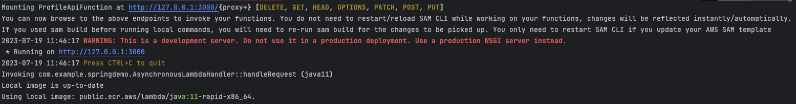
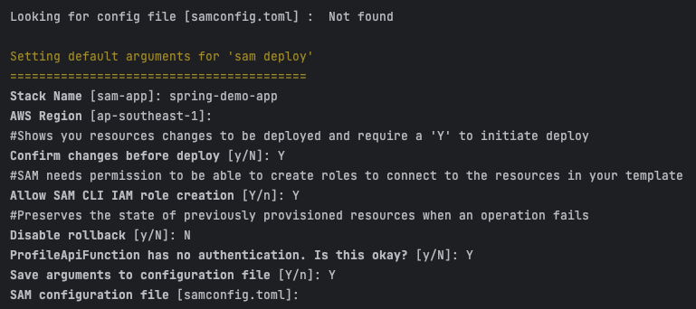
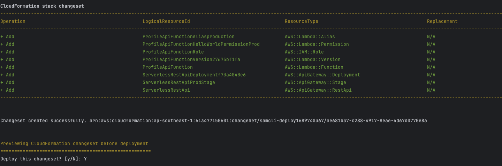
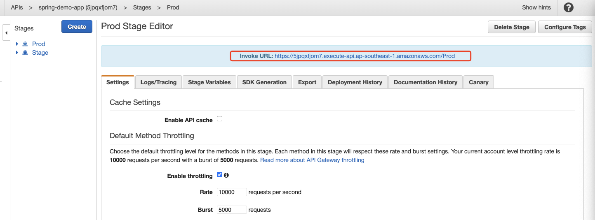
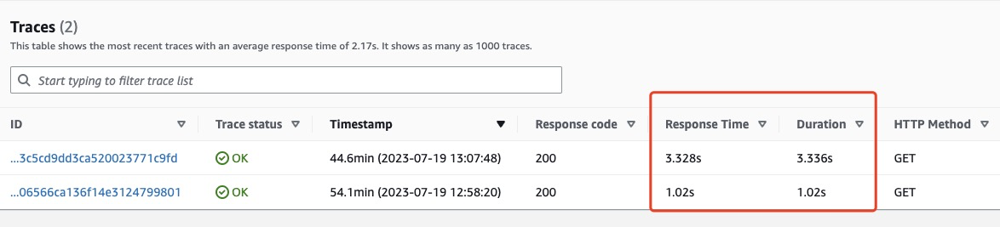
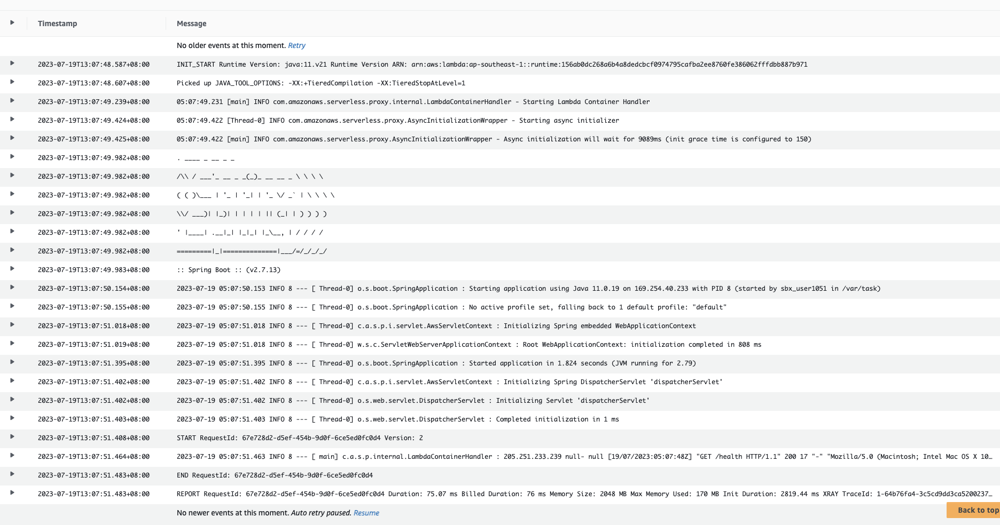
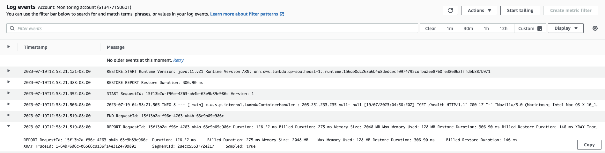

# Lambda on LLM with SageMaker


## From Springboot to Lambda

1. Add Dependencies and Plugin

https://github.com/awslabs/aws-serverless-java-container

``` xml
<dependency>
    <groupId>com.amazonaws.serverless</groupId>
    <artifactId>aws-serverless-java-container-springboot2</artifactId>
    <version>1.9.3</version>
</dependency>
```

```xml
<plugin>
    <groupId>org.apache.maven.plugins</groupId>
    <artifactId>maven-shade-plugin</artifactId>
    <version>3.4.1</version>
    <configuration>
        <createDependencyReducedPom>false</createDependencyReducedPom>
    </configuration>
    <executions>
        <execution>
            <phase>package</phase>
            <goals>
                <goal>shade</goal>
            </goals>
            <configuration>
                <artifactSet>
                    <excludes>
                        <exclude>org.apache.tomcat.embed:*</exclude>
                    </excludes>
                 </artifactSet>
            </configuration>
         </execution>
     </executions>
 </plugin>
```

2. Add Lambda Entry Point

``` java
import com.amazonaws.serverless.exceptions.ContainerInitializationException;
import com.amazonaws.serverless.proxy.model.AwsProxyRequest;
import com.amazonaws.serverless.proxy.model.AwsProxyResponse;
import com.amazonaws.serverless.proxy.spring.SpringBootLambdaContainerHandler;
import com.amazonaws.serverless.proxy.spring.SpringBootProxyHandlerBuilder;
import com.amazonaws.services.lambda.runtime.Context;
import com.amazonaws.services.lambda.runtime.RequestStreamHandler;

import java.io.IOException;
import java.io.InputStream;
import java.io.OutputStream;

public class AsynchronousLambdaHandler implements RequestStreamHandler {
    private SpringBootLambdaContainerHandler<AwsProxyRequest, AwsProxyResponse> handler;

    public AsynchronousLambdaHandler() throws ContainerInitializationException {
        handler = (SpringBootLambdaContainerHandler<AwsProxyRequest, AwsProxyResponse>) new SpringBootProxyHandlerBuilder()
                .springBootApplication(SpringDemoApplication.class)
                .defaultProxy()
                .asyncInit()
                .buildAndInitialize();
    }

    @Override
    public void handleRequest(InputStream inputStream, OutputStream outputStream, Context context)
            throws IOException {
        handler.proxyStream(inputStream, outputStream, context);
    }
}
```

**Note:** Do not forget to change the `springBootApplication` parameter with the application class name


## Local Test using SAM

```yaml
AWSTemplateFormatVersion: '2010-09-09'
Transform: AWS::Serverless-2016-10-31

Globals:
  Function:
    Timeout: 30

Resources:
  ProfileApiFunction:
    Type: AWS::Serverless::Function
    Properties:
      CodeUri: .
      Handler: com.example.demo2.AsynchronousLambdaHandler::handleRequest
      Runtime: java11
      AutoPublishAlias: production
      Architectures:
        - x86_64
      MemorySize: 2048
      Environment:
        Variables:
          JAVA_TOOL_OPTIONS: -XX:+TieredCompilation -XX:TieredStopAtLevel=1
      Events:
        HelloWorld:
          Type: Api
          Properties:
            Path: /{proxy+}
            Method: ANY
```

``` shell
sam build
sam local start-api
```

When it started, you should see similar informationb below




## Deploy Remote


```shell
sam deploy --guided
```






## Enable Tracing

Tracing can be enabled by adding the configuration below in `template.yaml`

```yaml
Globals:
  Function:
    Timeout: 30
    Tracing: Active
  Api:
    TracingEnabled: true
```


## Trigger from API Gateway

```shell
curl https://<APIGateway-URL>/<Stage>/health
# e.g. curl https://5jpqxfjom7.execute-api.ap-southeast-1.amazonaws.com/Prod/health
# it should return {"status": "ok!"}
```



## Enable SnapStart

Update `template.yaml`

``` yaml #9-10
Resources:
  ProfileApiFunction:
    Type: AWS::Serverless::Function
    Properties:
      CodeUri: .
      Handler: com.example.demo2.AsynchronousLambdaHandler::handleRequest
      Runtime: java11
      AutoPublishAlias: production
      # add snapstart
      SnapStart:
        ApplyOn: PublishedVersions
      Architectures:
        - x86_64
      MemorySize: 2048
      Environment:
        Variables:
          JAVA_TOOL_OPTIONS: -XX:+TieredCompilation -XX:TieredStopAtLevel=1
      Events:
        HelloWorld:
          Type: Api
          Properties:
            Path: /{proxy+}
            Method: ANY
```

And deploy it

``` shell
sam build
sam deploy
```

## Compare the Results



Without SnapStart



WithSnapStart



